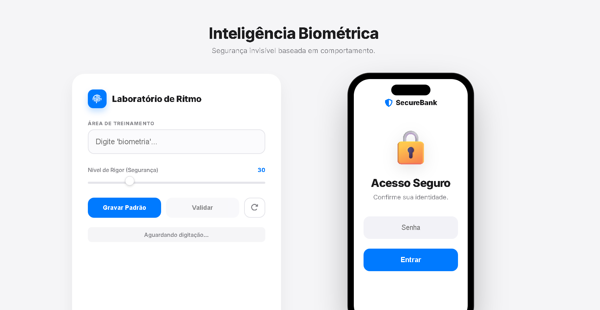

# 🛡️ BioPass: Behavioral Biometrics Engine

> **Segurança Bancária Invisível baseada em Dinâmica de Digitação (Keystroke Dynamics).**


## 📖 Sobre o Projeto

Em um cenário onde vazamentos de dados são comuns, **apenas a senha não é mais suficiente**. Ataques de *Account Takeover* (ATO) ocorrem quando hackers possuem as credenciais corretas da vítima.

O **BioPass** é uma prova de conceito (PoC) que implementa uma camada de segurança invisível. Ele analisa **não O QUE** o usuário digita, mas **COMO** ele digita.

O sistema captura o ritmo cognitivo e muscular (memória muscular) do usuário para criar uma "Assinatura Biométrica". Se um impostor tentar fazer login — mesmo com a senha correta — o sistema detecta a anomalia rítmica e bloqueia o acesso.

---

## 🚀 Funcionalidades Principais

* **Dashboard de Análise em Tempo Real:** Visualização gráfica do padrão de digitação usando `Chart.js`.
* **DNA da Digitação:** Comparação visual detalhada (letra por letra) entre o perfil do titular e a tentativa de acesso.
* **Motor de Risco Ajustável:** Um *slider* que permite calibrar a sensibilidade do algoritmo (tolerância em milissegundos), simulando diferentes políticas de segurança bancária.
* **Simulador Mobile (SecureBank):** Uma interface interativa que simula um aplicativo de banco real para testar a experiência do usuário final (UX).
* **Interface Clean & Minimalista:** Design inspirado em Fintechs modernas (Glassmorphism, Apple Style), focado em usabilidade.

---

## 🧠 A Lógica do Algoritmo (Keystroke Dynamics)

O diferencial deste projeto reside na implementação matemática da validação biométrica sem o uso de bibliotecas externas complexas de IA.

### 1. Aquisição de Dados (Data Acquisition)
O sistema escuta eventos de `keydown` no input. Para cada tecla pressionada, capturamos o *Timestamp* exato ($t$) em milissegundos.

### 2. Extração de Características (Flight Time)
Não analisamos o tempo total. Calculamos o **Flight Time** (Tempo de Voo) — o intervalo de latência entre soltar uma tecla e pressionar a próxima.

$$\Delta t_i = t_{i+1} - t_i$$

Isso gera um **Vetor de Características** único para cada tentativa:
> *Exemplo:* `[120ms, 45ms, 90ms, 200ms...]`

### 3. Comparação Vetorial (Pattern Matching)
O algoritmo compara o Vetor Mestre (Gravado) com o Vetor de Tentativa (Input Atual). Utilizamos o cálculo de **Diferença Absoluta Média** para determinar a divergência.

### 4. Limiar de Decisão (Decision Boundary)
Se a divergência média for menor que o `Threshold` (definido pelo slider de risco), a identidade é confirmada. Caso contrário, é classificada como anomalia.

---

## 💻 Tecnologias Utilizadas

* **Front-end:** HTML5 Semântico, CSS3 (Flexbox, Grid, Animations, Variables).
* **Lógica:** JavaScript (ES6+) Vanilla.
* **Visualização de Dados:** Chart.js.
* **Design:** Metodologia Mobile-First, Estética Clean/Minimalista.

---

## 📸 Screenshots


---

## 🛠️ Como Rodar Localmente

1.  Clone este repositório:
    ```bash
    git clone [https://github.com/luisa-collab/biopass.git](https://github.com/luisa-collab/biopass.git)
    ```
2.  Abra o arquivo `index.html` em qualquer navegador moderno.
3.  Não é necessário instalar dependências (Node.js/NPM), pois o projeto utiliza CDNs para as bibliotecas visuais.

---

## 🔮 Próximos Passos (Roadmap)

* [ ] Implementar persistência de dados (LocalStorage ou Database) para salvar perfis.
* [ ] Adicionar análise de *Dwell Time* (tempo que a tecla fica pressionada) para aumentar a precisão.
* [ ] Integrar com uma API de Backend para validação server-side.

---

## 👩‍💻 Autora

**Luisa Laura**
*Desenvolvedora Full Stack & Entusiasta de Cibersegurança*

[](http://www.linkedin.com/in/luisa-laura-a94634346)
[](https://github.com/luisa-collab)